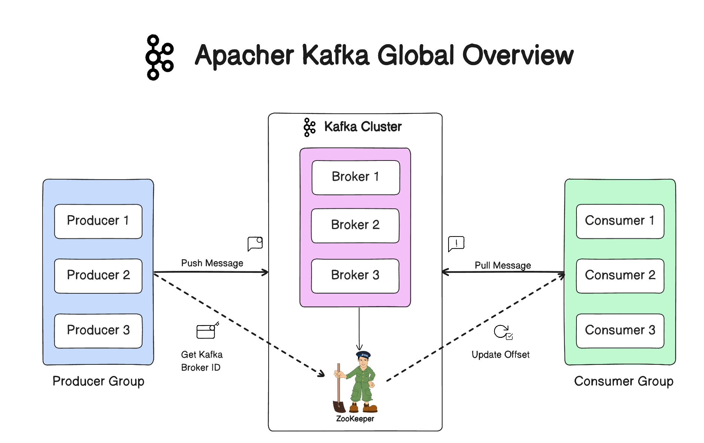
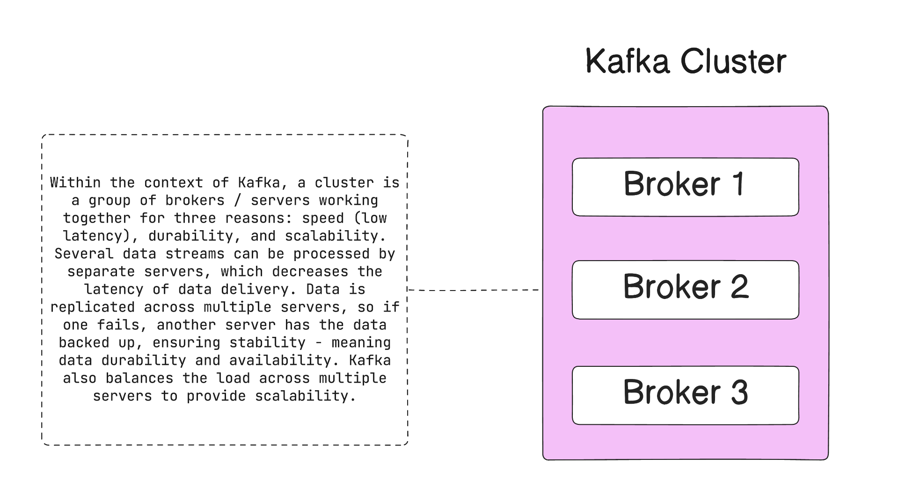
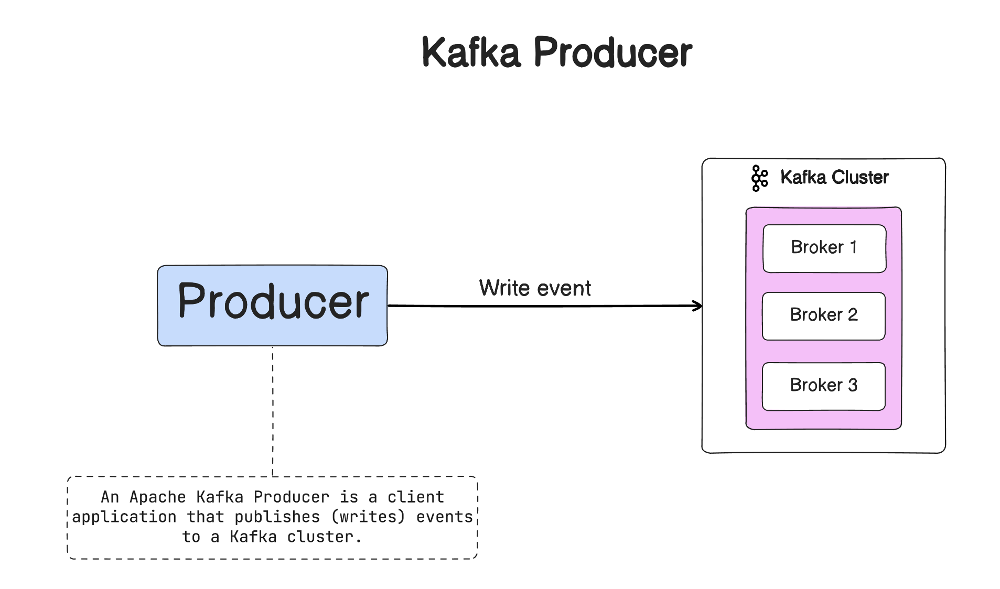
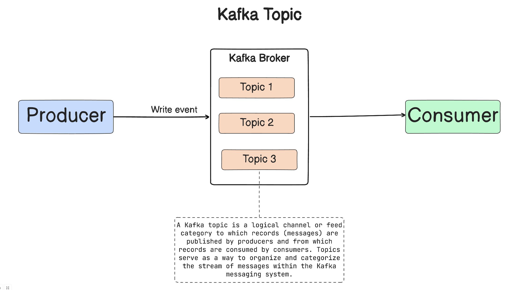
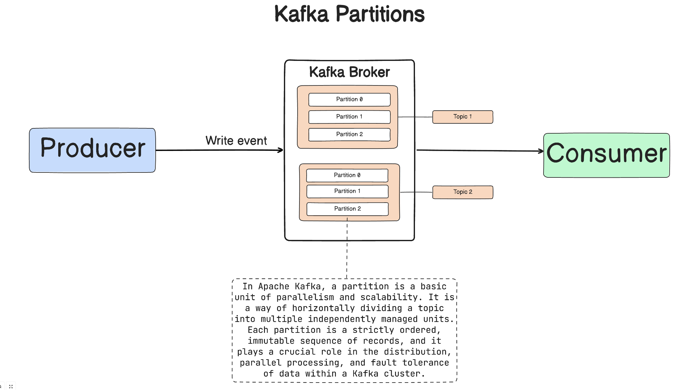
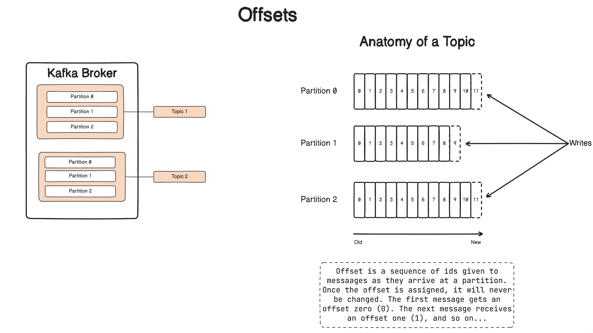
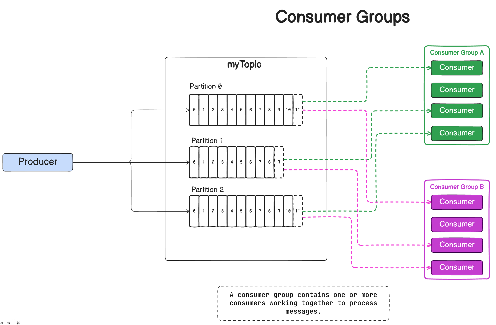
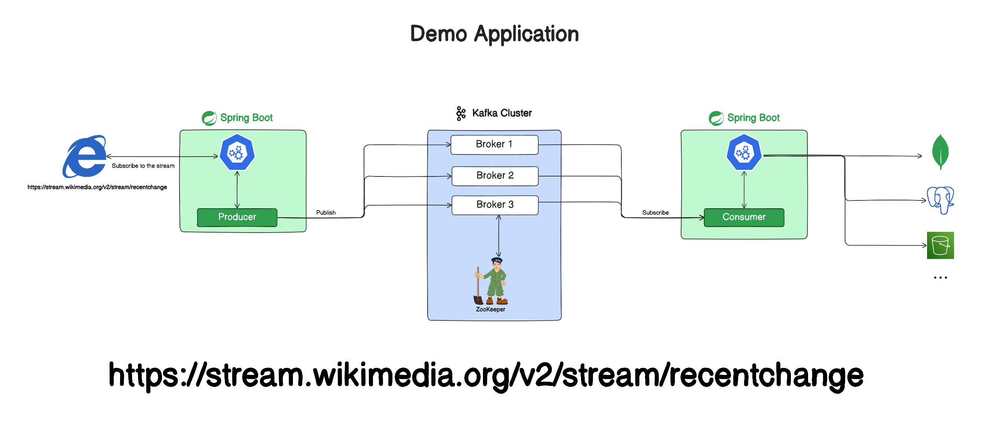

# Spring Boot Kafka Reactive Project

This is a sample Spring Boot project that demonstrates the integration of Kafka with a Spring Reactive application. The project showcases key concepts related to Kafka, including topics, partitions, serialization, consumer groups, and offset management.

## Table of Contents

- [Requirements](#requirements)
- [Getting Started](#getting-started)
    - [Running Kafka](#running-kafka)
    - [Project Setup](#project-setup)
- [Key Concepts](#key-concepts)
    - [Kafka Cluster](#kafka-cluster)
    - [Kafka Broker](#kafka-broker)
    - [Kafka Consumer](#kafka-consumer)
    - [Kafka Producer](#kafka-producer)
    - [Kafka Topics](#kafka-topics)
    - [Partitions](#partitions)
    - [Offsets](#offsets)
    - [Consumer Groups](#consumer-groups)
    - [Serialization](#serialization)
- [Demo Application](#demo-application)


## Requirements

- Java 17 or later
- Apache Kafka (for running locally)
- Maven (or use the included `./mvnw` script)

## Getting Started

### Running Kafka

Ensure that Kafka is installed and running locally. You can download Kafka from the [official Apache Kafka website](https://kafka.apache.org/).

Start a ZooKeeper server (required by Kafka):

```bash
bin/zookeeper-server-start.sh config/zookeeper.properties
```

Start a Kafka broker:
```bash
bin/kafka-server-start.sh config/server.properties
```


### Project Setup

Clone this repository and navigate to the project folder:

```bash
git clone https://github.com/ali-bouali/apache-kafka-with-spring-boot-reactive
cd apache-kafka-with-spring-boot-reactive
```

## Key Concepts

Apache Kafka is a distributed, fault-tolerant, and highly scalable message broker and stream processing platform. It was originally developed by LinkedIn and later open-sourced as an Apache Software Foundation project. Kafka is designed to handle large volumes of data streams in a real-time and fault-tolerant manner.

Key Components of Kafka:
Producer: An application that publishes messages to Kafka topics.

- **Consumer**: An application that subscribes to topics and processes the published messages.
- **Broker**: Kafka brokers form the core of the Kafka cluster, storing and managing the streams of records.
- **Topic**: A category or feed name to which records are published. Topics in Kafka are used to categorize messages.
- **Partition**: Topics are divided into partitions, allowing Kafka to parallelize processing and scale horizontally.
- **Zookeeper**: Kafka relies on Apache ZooKeeper for distributed coordination and management of the Kafka cluster.
  

### Kafka CLuster
A Kafka cluster is a group of one or more Kafka brokers (servers) working together to manage the storage and exchange of data in the form of messages. Kafka is designed to operate as a distributed system, and a cluster allows it to scale horizontally, provide fault tolerance, and handle large volumes of data across multiple nodes.


### Kafka Broker
Kafka brokers form the core of the Kafka cluster, storing and managing the streams of records.


### Kafka Producer
Producers are applications or systems that publish messages to Kafka topics. Producers determine which partition within a topic a message should be sent to.


### Kafka Consumer
Consumers are applications or systems that subscribe to Kafka topics and process the messages. Consumers can be part of a consumer group, allowing them to parallelize the processing of messages.


### Kafka Topics

A Kafka topic is a category or feed name to which records (messages) are published. Topics help organize and categorize messages.

---

### Partitions

Topics are divided into partitions, allowing for parallel processing and scalability. Each partition is assigned to a specific broker.

---

### Offsets

Offsets represent the position of a message within a partition. Consumers use offsets to track their progress and resume processing from the last committed offset.

---

### Consumer Groups

Consumer groups allow for parallel and scalable message processing. Consumers within a group coordinate to consume messages from one or more partitions.

---

### Serialization

Serialization is the process of converting data to a format suitable for transmission. Kafka allows custom serializers for key and value objects.


## Demo Application



To showcase the functionality of the application, I have developed two distinct projects:

1. **Producer Project:**
   The producer project leverages the **Spring Boot Reactive framework** to extract a data stream from [Wikimedia Recent Changes](https://stream.wikimedia.org/v2/stream/recentchange). This project is designed to efficiently read the streaming data and subsequently transmit the messages to a Kafka broker.

2. **Consumer Project:**
   The consumer project complements the aforementioned producer by retrieving messages from the Kafka topic. The retrieved messages are then persisted into a DynamoDB database. This dual-project configuration not only demonstrates the integration of Spring Boot Reactive with Kafka for real-time data processing but also showcases the seamless storage of this data in a DynamoDB database, emphasizing end-to-end functionality within the application.

